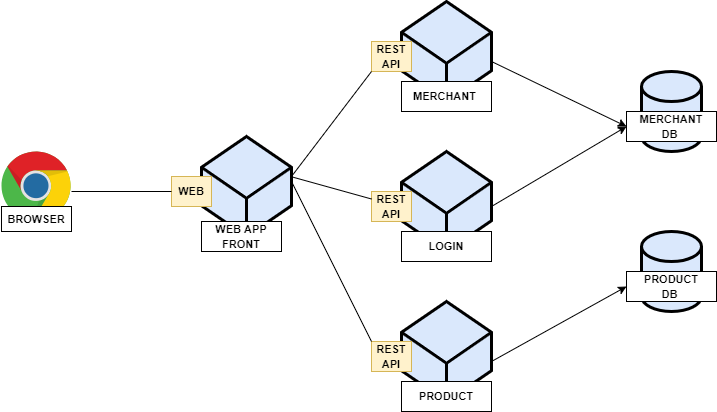
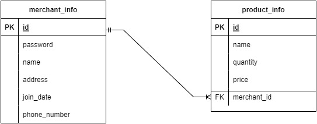

# architecture diagram
</img>
---
# ERD
</img>
---
# api contract
#Merchant
* merchant_info
```
{
  id:integer
  password:varchar(255)
  name:varchar(255)
  address:varchar(255)
  join_date:date
  phone_number:varchar(13)
}
```
**POST /merchant**
----
  Creates a new merchant and returns the new object.
* **URL Params**  
  None
* **Headers**  
  Content-Type: application/json  
* **Data Params**  
```
  {
    id:interger
    password:varchar(255)
    name:varchar(255)
    address:varchar(255)
    join_date:date
    phone_number:varchar(13)
  }
```
* **Success Response:**  
* **Code:** 200  
  **Content:**  `{ <merchant_object> }` 

**DELETE /merchant/:id**
----
  Deletes the specified merchant.
* **URL Params**  
  *Required:* `id=[integer]`
* **Data Params**  
  None
* **Headers**  
  Content-Type: application/json  
* **Success Response:** 
  * **Code:** 200 
* **Error Response:**  
  * **Code:** 404  
  **Content:** `{ error : "data not found" }`  

#Product
* product_info
```
{
  id: integer
  name: varchar(255)
  quantity : integer
  price : integer
  merchant_id:integer
}
```
**GET /merchant/product**
----
  Returns all products in the system.
* **URL Params**  
  None
* **Data Params**  
  None
* **Headers**  
  Content-Type: application/json  
* **Success Response:** 
* **Code:** 200  
  **Content:**  
```
{
  products: [
           {<product_object>},
           {<product_object>},
           {<product_object>}
         ]
}
``` 
**POST /merchant/product**
----
  Creates a new Product and returns the new object.
* **URL Params**  
  None
* **Data Params**  
```
{
  id: integer
  name: varchar(255)
  quantity : integer
  price : integer
  merchant_id:integer
}
```
* **Headers**  
  Content-Type: application/json  
* **Success Response:**  
* **Code:** 200  
  **Content:**  `{ <product_object> }` 
  * **Error Response:**  
  * **Code:** 404  
  **Content:** `{ error : "data not found" }`  
  OR  
  * **Code:** 500  
  **Content:** `{ error : "jwt must be provided" }`

**DELETE /merchant/product/:id**
----
  Deletes the specified product.
* **URL Params**  
  *Required:* `id=[integer]`
* **Data Params**  
  None
* **Headers**  
  Content-Type: application/json  
  Authorization: Bearer `<OAuth Token>`
* **Success Response:**  
  * **Code:** 200
* **Error Response:**  
  * **Code:** 404  
  **Content:** `{ error : "data not found" }`  
  OR  
  * **Code:** 500  
  **Content:** `{ error : "jwt must be provided" }`

**PUT /merchant/product/:id**
----
  Update the product.
* **URL Params**  
  *Required:* `id=[integer]`
* **Data Params**  
  None
* **Headers**  
  Content-Type: application/json  
  Authorization: Bearer `<OAuth Token>`
* **Success Response:**  
  * **Code:** 200
* **Error Response:**  
  * **Code:** 404  
  **Content:** `{ error : "data not found" }`  
  OR  
  * **Code:** 500  
  **Content:** `{ error : "jwt must be provided" }`
  
**POST /merchant/login**
----
 login.
* **URL Params**  
  none
* **Data Params**  
  None
* **Headers**  
  Content-Type: application/json  
* **Success Response:**  
  * **Code:** 200
* **Error Response:**  
  * **Code:** 404  
  **Content:** `{ error : "name not found" }`  
